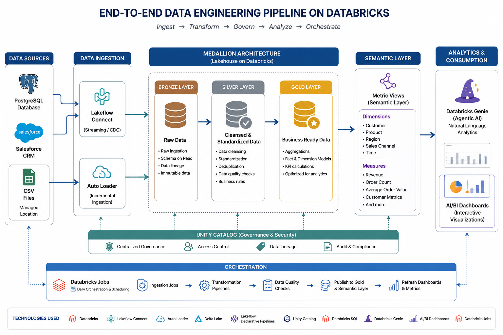

# End-to-End-Commercial-Data-Pipeline-Development-Using-Databricks

Organizations often store data across multiple systems and file formats, making unified analytics difficult. Commercial data is frequently distributed across disconnected platforms, creating data silos that limit visibility and data-driven decision-making.

This project demonstrates an end-to-end Data Engineering solution built on Databricks to ingest, process, transform, and analyze data from multiple sources using a modern Lakehouse architecture.

## Problem Statement

* Business data exists across multiple systems and formats.
* Commercial data is spread across disconnected sources, creating data silos.
* Manual integration and reporting processes are time-consuming and difficult to scale.
* Lack of a unified data platform makes analytics and business intelligence challenging.

## Solution Architecture

The solution leverages Databricks Lakehouse Platform to build a scalable and automated data pipeline following the Medallion Architecture (Bronze, Silver, Gold).

### Data Sources

* PostgreSQL Database
* Salesforce CRM
* CSV Files stored in a managed location

### Data Ingestion

* Lakeflow Connect for ingesting data from PostgreSQL and Salesforce
* Auto Loader for incremental ingestion of CSV files
* Automated schema inference and file discovery

### Data Processing & Transformation

Data transformation is implemented using Lakeflow Spark Declarative Pipelines.

#### Bronze Layer

* Raw ingestion of source data
* Schema preservation
* Data lineage tracking

#### Silver Layer

* Data cleansing and standardization
* Data quality validations using expectations
* Deduplication and business rule implementation
* Creation of conformed datasets

#### Gold Layer

* Business-ready analytical datasets
* Fact and dimension modeling
* Aggregated KPIs and reporting tables

## Semantic Layer

A semantic layer was created using Databricks Metric Views to define:

### Dimensions

*Transaction Date
*Year
*Quarter
*Month
*Product Category
*Brand
*Payment Mode
*Sales Channel
*Opportunity Stage
*Customer Type

### Measures

*Transaction Count
*Total Revenue
*Total Quantity
*Total Discount
*Avg Transaction Value
*Unique Customers

This provides a governed and reusable business layer for analytics and AI-powered querying.

## Analytics & Visualization

* Interactive dashboards built using Databricks AI/BI Dashboards
* Natural language analytics powered by Databricks Genie
* Self-service business intelligence through semantic models

## Orchestration & Automation

* Databricks Jobs used for workflow orchestration
* Daily scheduled execution of ingestion and transformation pipelines
* Automated end-to-end data refresh process

## Technologies Used

* Databricks
* Lakeflow Connect
* Auto Loader
* Lakeflow Spark Declarative Pipelines
* Delta Lake
* Unity Catalog
* Databricks SQL
* Metric Views
* Databricks Genie
* AI/BI Dashboards
* Databricks Jobs
* PostgreSQL
* Salesforce

## Key Outcomes

* Unified data from multiple enterprise systems into a single Lakehouse platform.
* Eliminated data silos through centralized data integration.
* Implemented scalable ETL pipelines using Medallion Architecture.
* Enabled governed business metrics through a semantic layer.
* Delivered AI-powered analytics and dashboarding capabilities.
* Automated daily data processing and reporting workflows.
